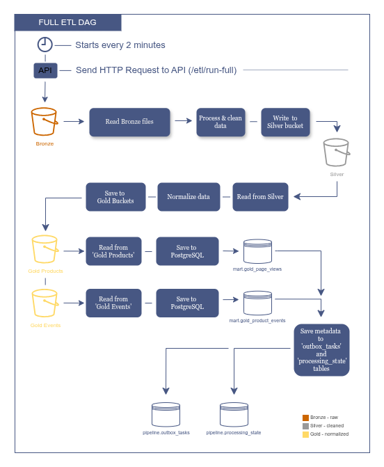
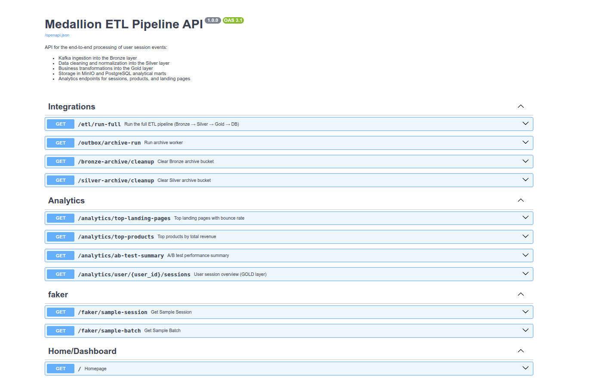

# Medallion ETL Pipeline

This project is a local data pipeline demo built around the Medallion pattern: **Bronze -> Silver -> Gold**.

It generates synthetic user session events, sends them through Kafka, stores raw and processed Parquet files in MinIO, loads Gold-level analytical tables into PostgreSQL, and exposes a small operational UI through FastAPI.

The main goal of the project is to show how I structure a backend/data system when there is more than one moving part: ingestion, object storage, orchestration, metadata, retries, protected operational endpoints, tests, and CI.

## Architecture


Main services:

- **FastAPI**: API, dashboard, background event generator, Kafka producer/consumer startup.
- **Kafka**: transport for generated session events.
- **MinIO**: object storage for Bronze, Silver, Gold, and archive buckets.
- **Airflow**: runs ETL, archive, and cleanup DAGs.
- **PostgreSQL**: stores Gold marts and pipeline metadata.
- **Kafdrop / pgAdmin / MinIO Console**: local inspection tools.
- **GitHub Actions**: runs the Docker-based test suite on push and PR.

## Project Structure

```text
.
├── airflow/dags/                 # Airflow DAGs and shared HTTP client
├── init-db/                      # Airflow/Postgres initialization files
├── scripts/                      # Init scripts used by Docker services
│   └── init/                     # PostgreSQL schema initialization
├── services/
│   ├── fastapi_app/              # FastAPI app, dashboard, API routes, ETL services
│   ├── faker/                    # Synthetic event generator
│   ├── kafka/                    # Kafka producer/consumer helpers
│   ├── medallion_models/         # Bronze/Silver/Gold dataclasses and transforms
│   ├── init-topic/               # Kafka topic initialization image
│   └── minio-init/               # MinIO bucket initialization image
├── tests/                        # Docker-based pytest suite
├── readme_assets/                # README screenshots and diagrams
├── docker-compose.infra.yml      # Kafka, MinIO, PostgreSQL, pgAdmin, Kafdrop
├── docker-compose.app.yml        # FastAPI application service
├── docker-compose.airflow.yml    # Airflow scheduler/webserver/api/dag-processor
├── docker-compose.tests.yml      # Test runner compose file
├── Makefile                      # Local developer commands
└── .github/workflows/ci.yml      # GitHub Actions CI
```

Runtime folders such as `pgdata`, `minio-data`, and `shared_logs` are created locally and are not part of the source code.

## Data Flow

1. FastAPI starts a background generator.
2. The generator creates fake user session events.
3. Events are sent to Kafka.
4. A consumer writes incoming events to Bronze Parquet files in MinIO.
5. Airflow triggers the full ETL flow.
6. Bronze files are transformed into Silver files.
7. Silver files are transformed into two Gold datasets:
   - `gold_page_views`
   - `gold_product_events`
8. Gold files are loaded into PostgreSQL.
9. Processed files are registered in `pipeline.outbox_tasks`.
10. Archive and cleanup DAGs move/remove files based on outbox state.

## Medallion Layers

### Bronze

Raw Kafka events are written to MinIO as Parquet files. The Bronze layer is append-only: raw data is not updated in place.

### Silver

Bronze events are cleaned and normalized into a more consistent event shape. Silver still lives in MinIO, so intermediate data is not coupled to PostgreSQL.

### Gold

Silver events are split into analytics-ready datasets:

- page views
- product events

Gold data is then loaded into PostgreSQL tables used by the analytics endpoints.

## Airflow DAGs

### Full ETL DAG

Runs Bronze -> Silver -> Gold -> PostgreSQL.



### Archive DAG

Reads pending outbox tasks and moves processed files from active buckets to archive buckets.


### Cleanup DAGs

Remove archived files from MinIO after the archive step.


## Dashboard

The dashboard is available at:

```text
http://localhost:8000/
```

It shows:

- Bronze / Silver / Gold file and row counts
- Gold-level page view and product event counters
- latest 5 ETL runs from `pipeline.etl_runs`
- outbox task status counts
- links to Swagger UI and ReDoc

The dashboard uses HTMX to refresh live metrics without a full page reload.


## API Docs

FastAPI docs:

```text
http://localhost:8000/docs
http://localhost:8000/redoc
```



The API is split into:

- analytics endpoints
- demo data inspection endpoints
- operational ETL/archive/cleanup endpoints
- dashboard partial endpoints

## Protected Operational Endpoints

Endpoints that can change pipeline state or delete files require a simple API token.

Protected endpoints:

- `GET /etl/run-full`
- `GET /outbox/archive-run`
- `GET /bronze-archive/cleanup`
- `GET /silver-archive/cleanup`

Token config:

```env
OPERATIONAL_API_TOKEN=medallion-ops-token
```

Request header:

```http
X-API-Token: medallion-ops-token
```

Example:

```bash
curl -H "X-API-Token: medallion-ops-token" http://localhost:8000/etl/run-full
```

Without the header, or with a wrong token, the API returns `401`.

Airflow DAGs use the same protected endpoints, but they do not hardcode the
header in every DAG. The shared Airflow HTTP client reads
`OPERATIONAL_API_TOKEN` from the Airflow container environment and injects
`X-API-Token` automatically. Manual calls through Swagger, browser, or `curl`
must provide the header explicitly.

This is not meant to be a full auth system. It is a small guard for local operational endpoints that should not be accidentally triggered from the browser or by unauthenticated clients.

## Local Setup

Requirements:

- Docker
- Docker Compose
- Make

Create the local env file:

```bash
cp .env.example .env
```

Start everything:

```bash
make up
```

Check containers:

```bash
make ps
```

Useful local URLs:

```text
FastAPI dashboard: http://localhost:8000/
Swagger UI:        http://localhost:8000/docs
Airflow:           http://localhost:8080/
MinIO console:     http://localhost:9101/
Kafdrop:           http://localhost:9000/
pgAdmin:           http://localhost:8889/
```

Follow logs:

```bash
make logs
```

Stop containers:

```bash
make down
```

Clean local runtime state:

```bash
make clean CONFIRM=1
```

`make clean` removes Docker volumes and local runtime folders, so it requires `CONFIRM=1`.

## How to Verify Locally

Short verification flow:

```bash
cp .env.example .env
make clean CONFIRM=1
make up
make ps
make test
```

Then check:

- dashboard opens at `http://localhost:8000/`
- Swagger opens at `http://localhost:8000/docs`
- protected operational endpoints return `401` without `X-API-Token`
- protected operational endpoints work with `X-API-Token: medallion-ops-token`
- Airflow DAGs can call protected endpoints through the shared HTTP client
- latest ETL runs appear in the dashboard

Detailed verification steps are in [docs/local-verification.md](docs/local-verification.md).

## Makefile

```text
make up       Build and start the full local stack
make ps       Show service status
make logs     Follow logs for all services
make test     Run the Docker test suite
make down     Stop the local stack
make clean    Stop stack and remove local runtime state
```

## Tests

Run tests:

```bash
make test
```

The tests run in Docker through `docker-compose.tests.yml`.

Current tests cover:

- database URL configuration
- Kafka consumer configuration
- MinIO manager behavior with dummy clients
- Medallion idempotency checks
- Gold loader duplicate-processing prevention
- operational API token validation

## CI

The GitHub Actions workflow runs on push and pull request to `main`.

It does four things:

1. checks that local `.env` files are not tracked
2. creates `.env` from `.env.example`
3. validates `docker-compose.tests.yml`
4. runs `make test`

Workflow file:

```text
.github/workflows/ci.yml
```

## Reliability Details

### Idempotency

The ETL code checks existing archive outbox records before processing files. This prevents the same active file from being processed twice if `/etl/run-full` is triggered again before the archive worker has moved it.

### ETL Run History

Each `/etl/run-full` call creates a row in `pipeline.etl_runs`.

The dashboard shows the latest runs with:

- status
- Bronze row count
- Silver row count
- Gold row count
- loaded row count
- start time

### Outbox

`pipeline.outbox_tasks` tracks file lifecycle work. Archive workers use it to decide which files should be moved and whether each task is `PENDING`, `IN_PROGRESS`, `DONE`, or `FAILED`.

### Docker Build Context

The repository includes `.dockerignore` so Docker builds do not receive `.git`, local env files, caches, logs, or local runtime data.

## Main Endpoints

Analytics:

- `GET /analytics/top-landing-pages`
- `GET /analytics/top-products`
- `GET /analytics/ab-test-summary`
- `GET /analytics/user/{user_id}/sessions`

Demo data:

- `GET /faker/sample-session`
- `GET /faker/sample-batch`

Operational:

- `GET /etl/run-full`
- `GET /outbox/archive-run`
- `GET /bronze-archive/cleanup`
- `GET /silver-archive/cleanup`

Dashboard:

- `GET /`
- `GET /dashboard/metrics`
- `GET /dashboard/operations`

## What I Focused On

- separating raw, cleaned, and analytical data layers
- keeping intermediate data in object storage
- making repeated ETL runs safe
- tracking file lifecycle through an outbox table
- exposing enough operational state in the dashboard
- keeping operational endpoints protected
- making local setup reproducible with Docker Compose and Make
- covering important behavior with focused tests
- running tests in CI

## Limitations

This is a local Docker Compose project. It is not a production deployment.

Things I intentionally did not add:

- Alembic migrations
- full user auth / roles
- production secrets management
- distributed locking for multiple ETL workers
- full end-to-end integration tests for the entire stack
- real S3 lifecycle policies
- deployment manifests

For this project, I kept the scope around local reproducibility, pipeline behavior, and operational clarity.
